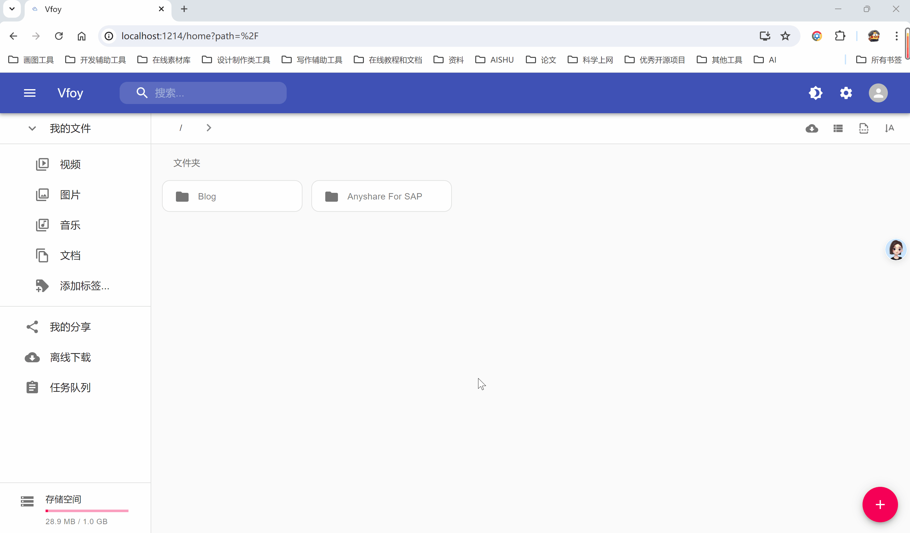

# Vfoy
云盘系统

该项目基于Cloudreve改造，通过打通MaxKB实现基于文档或文件夹的知识问答。可实现对文档问答或对文件夹内所有的文档进行提问。

# 构建静态资源

```
# 进入前端子模块
cd assets
# 安装依赖
yarn install
# 开始构建
yarn build
# 构建完成后删除映射文件
cd build
find . -name "*.map" -type f -delete
```

完成后，所构建的静态资源文件位于 assets/build 目录下。

静态资源有两种方式构建：

1. 将build目录改名为statics 目录，放置在 主程序同级目录下并重启服务。
2. 将build目录压缩为zip文件，文件名为vfoy-frontend.zip，放置在 主程序同级目录下并重启服务。

# 效果演示


